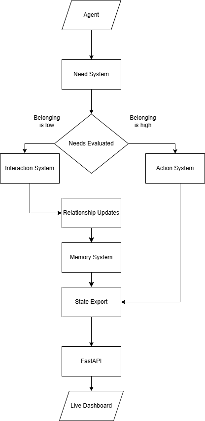
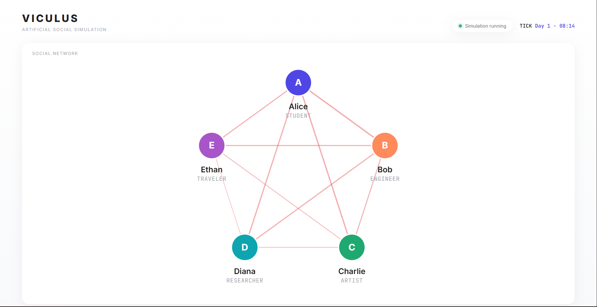
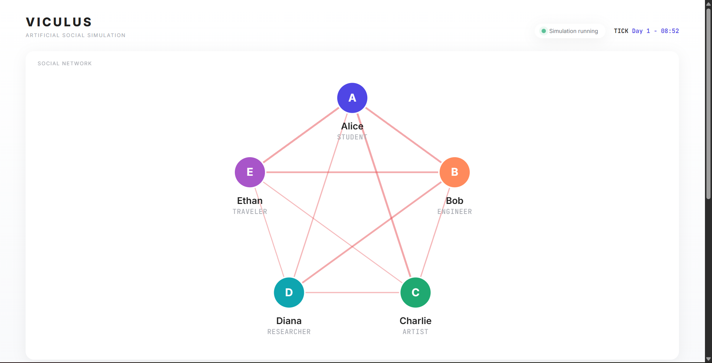
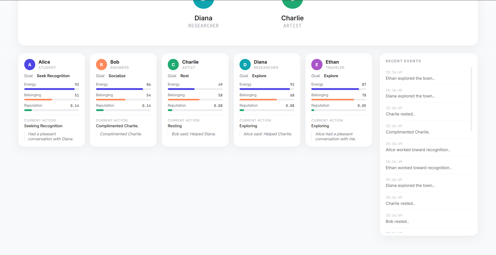
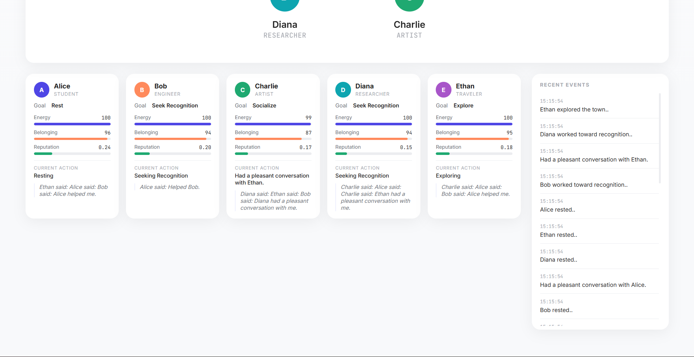

# Viculus

**Viculus** is an agent-based artificial society simulator that explores how individual personalities, needs, memories, and relationships give rise to emergent social behaviour.

Rather than scripting interactions, each agent independently evaluates its internal state, chooses goals, interacts with others, forms memories, and continuously reshapes the social network around it.

The simulation is visualized through a real-time dashboard that exposes both the internal state of each agent and the evolving structure of the society.


# Overview

Most simulations focus on movement or task completion.

Viculus instead focuses on **social emergence**.

Every individual operates autonomously using a utility-based decision system driven by psychological needs and personality traits. As agents interact, they gradually develop friendships, trust, reputation, and memories that influence the state of the society.

Instead of viewing agents as isolated entities, Viculus visualizes society as an evolving social graph whose structure changes as relationships strengthen or weaken over time.


# Key Features

### Autonomous Decision Making

Each agent independently selects goals based on its current needs and personality rather than following predefined scripts.

### Dynamic Social Interactions

Agents can

- Hold conversations
- Help others
- Compliment
- Ignore
- Insult

Each interaction alters both participants and affects future social dynamics.

### Persistent Memory

Important interactions are stored as memories, allowing agents to retain a history of previous encounters.

### Relationship Graph

The social network updates continuously as interactions occur.

Connections between agents encode multiple relationship metrics into a single visual representation.

### Live Simulation Dashboard

The dashboard visualizes

- Agent states
- Current goals
- Needs
- Reputation
- Memories
- Event stream
- Social network

in real time.


# Relationship Visualization

Every edge in the network represents the relationship between two agents.

Relationship strength is computed from

- Friendship
- Trust
- Respect

using

```python
(friendship + trust + respect) / 3
```


# Simulation Architecture


The simulation pipeline follows the workflow below.

<p align="center">
  
</p>

### Simulation Flow

1. Agent evaluates internal needs.
2. Decision system selects the highest priority goal.
3. Social goals trigger interactions, while other goals invoke actions.
4. Relationships, memories and reputation are updated.
5. Current simulation state is exported as JSON.
6. FastAPI streams the latest state to the live dashboard.


# Agent Model

Each agent maintains four major components.

## Personality

- Kindness
- Extroversion
- Ambition
- Curiosity
- Confidence

These traits influence how goals are prioritized and how agents interact with one another.

## Needs

Agents continuously manage

- Energy
- Belonging
- Recognition
- Curiosity

The most urgent need influences the agent's next objective.

## Relationships

Relationships are tracked independently for every pair of agents using

- Friendship
- Trust
- Respect

These values evolve with every interaction and naturally decay over time.

## Memory

Agents retain important social experiences which are surfaced in the dashboard as their latest memory.


# Technology Stack

| Layer | Technology |
|--------|------------|
| Language | Python |
| Backend | FastAPI |
| Simulation | NetworkX |
| Frontend | HTML, CSS, JavaScript |
| Visualization | SVG |
| Data | JSON |


# Screenshots

### Social Network

<p align="center">
  
</p>
<p align="center">
  
</p>


The network graph visualizes relationships between every pair of agents.

- **Node color** uniquely identifies each agent.
- **Edge thickness** represents relationship strength.
- **Darker red edges** indicate stronger positive relationships.
- **Light pink edges** indicate weaker positive relationships.
- **Gray edges** represent neutral or deteriorated relationships.

Because relationships continuously evolve through interactions, the graph changes organically as the simulation progresses.

### Agent Dashboard

<p align="center">
  
</p>
<p align="center">
  
</p>

Each agent card displays:

- Current goal
- Energy level
- Belonging level
- Reputation
- Current action
- Most recent memory


# Future Work

Planned improvements include

- Emotion modelling
- Memory-driven decision making
- Multi-agent conversations
- Community formation
- Occupation-specific behaviour
- Economic systems
- LLM-powered dialogue generation
- Timeline playback
- Simulation analytics

# Motivation

The project was built to explore **emergent behaviour**—the phenomenon where intricate system-wide patterns arise from the interactions of many independent individuals, without any central controller.

Rather than scripting friendships, communities, or social dynamics, each agent is given only its own personality, internal needs, memories, and decision-making process. From these simple components, relationships naturally form, evolve, and decay over time.

By visualizing both the internal reasoning of each agent and the changing social network, Viculus aims to make emergent behaviour observable, explainable, and interactive.

# License

This project is intended for educational and research purposes.
